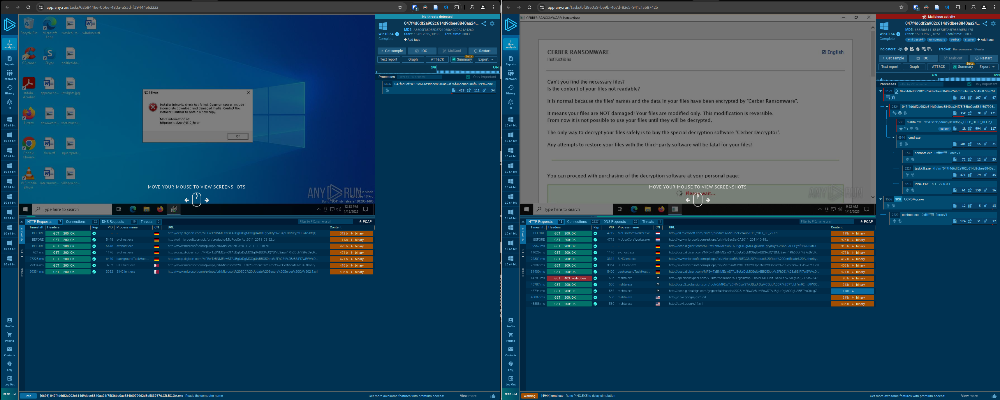
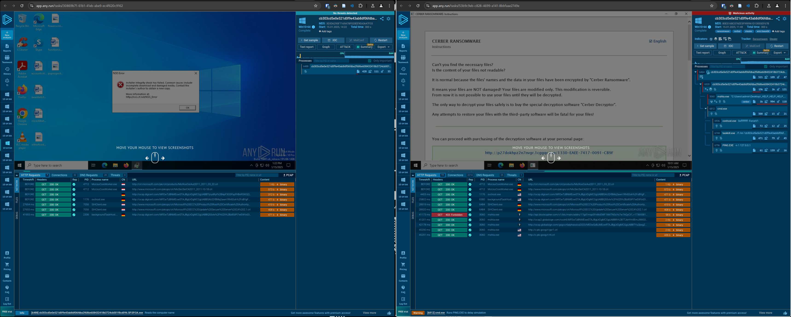
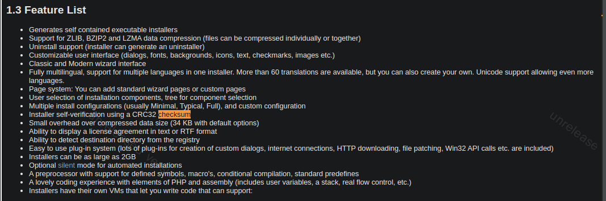
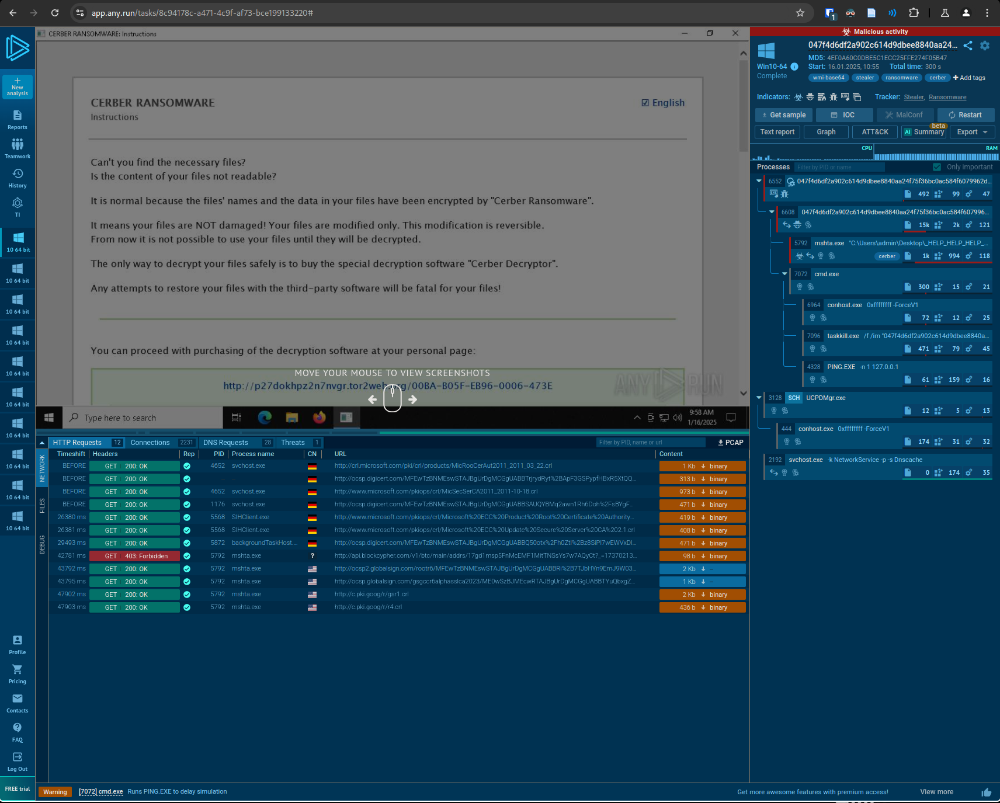
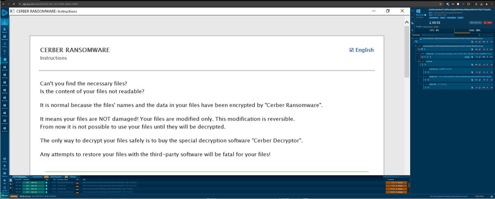

# Functionality Test

Hybrid Mode was run on test data.

From the evasive samples 20 random samples were selected using the command: `find evasive_samples_folder -type f | shuf -n 20`

After that the original sample, the evasive sample and the minimized sample were dynamically analyzed for each of the selected samples (total of 60 samples) using the online sandbox https://any.run.

## Analysis Results

hash | original | evasive | modifications | minimal | minimal modifications
:-: |:-: | :-: | :-: | :-: | :-:
0f08244193e78cfb3b373694f3def175bff3e94a1d72716f435f58e3331a942d | https://app.any.run/tasks/1bd2211d-1283-46dc-a501-4ea9cb5ca386 | https://app.any.run/tasks/5e8c2c8c-ee5f-4b77-ac10-b1d0d5f2a67b | CR OA | https://app.any.run/tasks/f345842f-baba-4536-bfc3-70aabed42ccc | OA
3a2632bbfe3324c1ea626d10ed745396af8e63babdad79130c9b63821cdadfbc | https://app.any.run/tasks/08b37c25-1052-4c0d-9534-a0e5e33fc973 | https://app.any.run/tasks/e1ee4b88-f73d-41ee-8044-a8b49780e2e0 | OA | https://app.any.run/tasks/ab1650b1-6017-4e87-b1f5-ae8a4a149b23 | OA
6c169a5a0bdbc4e5d2e8f8f24bef189bddcd70ec74302aa69de3cfabd07c3a27 | https://app.any.run/tasks/5396080e-3921-4a7e-8732-04bc5ee1f945 | https://app.any.run/tasks/6dfb6ca6-701c-4067-8aff-b41098be31c7 | RD BC SP SP SR SR SR SR | https://app.any.run/tasks/87e48321-4e73-4207-baa2-65f94e9b372f | SR SR1
7c7e50f0309a712d68fab3101725e85d0941abf89bf8878a2c2f1d2c1d0cf004 | https://app.any.run/tasks/beb4d96b-7c98-402f-b564-68ae888e99ef | https://app.any.run/tasks/55ca6133-3f2d-4f9d-9091-0793f990bf22 | CR SP RD SR SR | https://app.any.run/tasks/76f21dc5-d31a-4613-a477-e8ba4f83aa3c | SR1 SR
9a9abba0d2824b29ce62d7fc7970ae8a635ea808ceefcd383c57b3457ef1febe | https://app.any.run/tasks/12097f64-7281-4fd2-ae2e-8fa620c49802 | https://app.any.run/tasks/95a1a6f2-0dd3-4bba-8ee2-b3b801232e01 | CR OA BC OA OA | https://app.any.run/tasks/c8ebba0b-5855-4be5-90d4-924a93cecc11 | OA
9bf9659fc51feb7d943f796b20b8b0f5e05f8aa97955f52c26fca9399baf50c5 | https://app.any.run/tasks/e3070cf7-e74a-4098-8c1a-cbc502f9f26a | https://app.any.run/tasks/6626d7ea-ad1b-45fe-82b7-a6053df76292 | SA OA SA | https://app.any.run/tasks/006c774b-e50b-4eff-8fda-083c5f6c88b7 | OA
22bbb78d3642f1c907a2f7eaddc964c4768fe1bc85a559a624082d1ee1fa5c81 | https://app.any.run/tasks/343a1dc1-d69a-4de6-927a-2fdbef65e528 | https://app.any.run/tasks/d0763f78-fff3-459b-acf4-0169b81cdd93 | OA | https://app.any.run/tasks/313e2b51-4312-49f7-a57b-8f14a314edec | OA
24c9f0f492d3134191caf578bf5d104de9829d1fa310563b31165245f5d13a8c | https://app.any.run/tasks/211e79cd-8b9f-4b50-9bba-46133dbc4e61 | https://app.any.run/tasks/ea9712bb-0eb1-4248-bb33-1bf58011316c | CR OA OA RC OA SP OA | https://app.any.run/tasks/b3c7187c-222a-400d-b794-70b7ea53ad94 | OA OA
047f4d6df2a902c614d9dbee8840aa24f75f36bc0ac584f6079962d8e5837676 | https://app.any.run/tasks/bf28e0a9-be9b-467d-82e5-941c1a68742b | https://app.any.run/tasks/6268446e-056e-483a-a53d-f39444e62222 | CR BC OA | https://app.any.run/tasks/8c94178c-a471-4c9f-af73-bce199133220 | OA
85fa592bf685966d8da1cf72f2c6c092b40664de9c17d9cc4894f8f08e06f567 | https://app.any.run/tasks/7980002f-911e-4bf3-8f7d-ad9bcc29b011 | https://app.any.run/tasks/49333ff3-825c-4cad-9e10-aedcd971277f | OA | https://app.any.run/tasks/58375630-a50f-47f0-8bbc-af45899690e9 | OA
96f42ae35f4fb8963f6ee3c19a2bb070b3959291e209586c19984de3e2b544b8 | https://app.any.run/tasks/873639f7-f4a1-43aa-abb9-7999b74e1db1 | https://app.any.run/tasks/d854a59f-2663-4f43-8c86-3f51278a75a7 | SA OA SR OA OA RD SR | https://app.any.run/tasks/beb9d478-9e4b-4803-9e95-46aa69e7829b | OA SR
673d38254d548df1944734553197a8dc4bdb5278007e2489e875312d93339d6c | https://app.any.run/tasks/807d2bc8-44c1-4ddb-a2f3-5c3106b8206b | https://app.any.run/tasks/2a4c4dff-cc73-4d69-8872-8e5c59ad0ba7 | SA OA OA BC RC SR RD SA SR SR | https://app.any.run/tasks/902e65e0-f6e3-4e25-9b5b-772b911e86c7 | RC SR1
756bb6bce4fda59d409bf0e78f3e3e3bb6ef259c76ae08031746e0a5ad01ed42 | https://app.any.run/tasks/1b6c55c0-080a-4211-b323-df47436601d6 | https://app.any.run/tasks/407dc9b5-c3c8-4d31-af97-8b9cad34e22a | RC RD OA OA SP SA BC SP SR OA | https://app.any.run/tasks/44d8d937-a4c8-41e6-833e-03b93b830134 | RC OA SR OA
7329933fadf17909b8cdd37b397b720e6f6b280bc45c8958130ee893e24f81bf | https://app.any.run/tasks/916a576c-62a2-4172-b8ad-471fb47e837f | https://app.any.run/tasks/94220edd-77b5-4dc3-bc46-581cff2f84fc | RD OA RC BC OA | https://app.any.run/tasks/74b14342-0f15-4603-94a2-28bc274d287e | OA
a12374b7c9d8420f597e21e4fdf31dd6afb339b4a1f02c95743079ce2e1b5c96 | https://app.any.run/tasks/fff3925e-50e9-4130-8125-446d5a648499 | https://app.any.run/tasks/c1702aa0-ceef-4800-bc74-52ba55636fe3 | BC SR SR | https://app.any.run/tasks/54f806fd-d9fa-4f69-a37c-e0bb20c0e65f | SR
b58436788a38f811db28dcb6f7695edc50eb672542a5c561af9c238475fca79e | https://app.any.run/tasks/44b35e4b-7851-4be7-9076-c0e1161cb9c1 | https://app.any.run/tasks/e69f2876-a5ff-4fc9-bc08-4279f44da87e | CR RD BC SP RC SR OA SP SA | https://app.any.run/tasks/d8063c55-25f6-4e4f-90c2-02a36e3da18b | OA
cb303cd5e0e521d0f9e43ab8df06fdba2f686e608432418b3724cb001f8cd096 | https://app.any.run/tasks/53b9c9eb-c828-4699-a141-8bbfaae2749e | https://app.any.run/tasks/30869b71-61b1-41eb-abe9-ec4f620c9162 | SP SP OA | https://app.any.run/tasks/cb56c9e3-09cc-4c41-9d4b-38e8cc74290f | OA
cdc768833bdd3bf35eec207556091ed3f2f0b653a925cf9f5b7f72686d00a6fd | https://app.any.run/tasks/daa28fdc-8413-43ac-bef0-0eb6695bdef4 | https://app.any.run/tasks/090390c4-7edb-426f-9c2f-d88c962ee22a | CR RD OA SP OA RC SA OA | https://app.any.run/tasks/4c71dc0b-ed82-477a-a0e1-4991b3eb8688 | OA
d9d9ac0fd2d3f36af73577bcc132e265d119e1d0f817e82582f2351e000edacf | https://app.any.run/tasks/b558ca61-edb0-4a12-9832-e1e246462cb3 | https://app.any.run/tasks/0c638036-e5db-4173-8ea7-5ea818f2ab5b | CR OA | https://app.any.run/tasks/a1328da0-1c4a-4362-bd5d-0e21928af0a7 | OA
d9ee8f9536728a926f372eee3635cb77450957c1e44fbafc9c079f8b2e7bf69e | https://app.any.run/tasks/8f0f0a00-b84d-48cd-8337-265d6e1c664f | https://app.any.run/tasks/f81206d0-486b-4954-aed2-edadf63cd98e | SP SR BC OA | https://app.any.run/tasks/d2ba0ebc-f9f8-4c13-a2a5-3198f4a507f5 | OA

### Modification List
shortname | action
:-:|:-:
OA | overlay_append
OA1 | overlay_append_one_byte
SR | section_rename
SA | section_add
SA1 | section_add_one_byte
SP | section_append
SP1 | section_append_one_byte
RC | remove_signature
RD | remove_debug
BC | break_optional_header_checksum
CR | code_randomize
CP1 | code_section_append_one_byte
SR1 | section_rename_random

## Broken Samples
047f4d6df2a902c614d9dbee8840aa24f75f36bc0ac584f6079962d8e5837676:

cb303cd5e0e521d0f9e43ab8df06fdba2f686e608432418b3724cb001f8cd096

Both samples are versions of "cerber ransomware" which was built using nsis (https://nsis.sourceforge.io/Main_Page).
This software for creating Windows installers has a feature which prevents broken installers from executing.
The feature is called installer self-verification and uses a CRC32 checksum.

Interestingly the minimized version of the Sample 047f4d6df2a902c614d9dbee8840aa24f75f36bc0ac584f6079962d8e5837676 did work again:

Here the operations CR and BC were removed and only OA was applied.

The same worked for cb303cd5e0e521d0f9e43ab8df06fdba2f686e608432418b3724cb001f8cd096 where the SP and SP operation was removed and only the OA operation remained applied:

In both cases only the OA action was still present. Therefor it seems, that the OA action does not interfere with Checksums generated by NSIS.

## Conclusion

It can be assumed that the modifications per se do not impede the functionality of the samples. In case of samples with integrity checks, a functionality loss can occur. However, this is not an issue of the modification process.