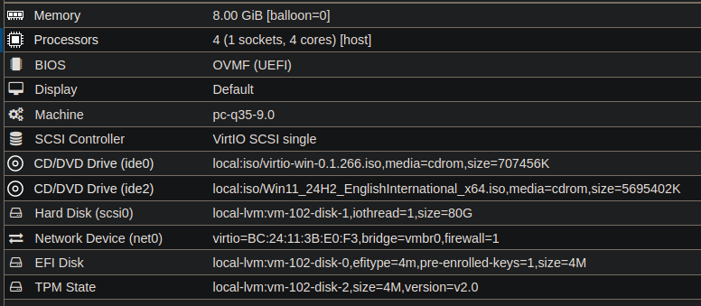
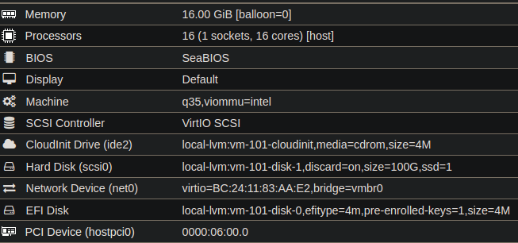

# Setup der Infrastruktur

## Proxmox
Erstellen von 2 VMs:
* av-server

  

  The Windows Server needs a TPM2 device and the virtio drivers mounted as a CD/DVD Drive.

* ml-server

  

  The ml-server has the host gpu as a pci passthrough device configured. In order to avoid problems with cuda it also needs to have bios and not efi configured.

## av-server
Create normal Windows VM.

Install latest Defender Updates

Disable automated sample submission.


Create a shared folder: 
* Create a folder named "share" on the Desktop folder of the guest machine.
* Right-click the folder and click "Properties". 
* Open the "sharing" tab and click "Advanced Sharing".
* Check the "share this folder" box and click on "Permissions". 
* Choose "everyone" to give full control. Open the "Security" tab and click Edit. 
* Select "Everyone" in the "Group or user names" to give full control. 
* If "Everyone" does not exist, click on "Add" to create one.


## ml-server
### VM Setup
Created a proxmox vm with the following important changes:
* Changed EFI to SEABIOS
* Added the host GPU as Raw PCIE Device (Device 0000:06:00.0)

### Docker 
Set up the docker apt repository:

```bash
sudo apt-get update
sudo apt-get install ca-certificates curl
sudo install -m 0755 -d /etc/apt/keyrings
sudo curl -fsSL https://download.docker.com/linux/debian/gpg -o /etc/apt/keyrings/docker.asc
sudo chmod a+r /etc/apt/keyrings/docker.asc
echo \
  "deb [arch=$(dpkg --print-architecture) signed-by=/etc/apt/keyrings/docker.asc] https://download.docker.com/linux/debian \
  $(. /etc/os-release && echo "$VERSION_CODENAME") stable" | \
  sudo tee /etc/apt/sources.list.d/docker.list > /dev/null
sudo apt-get update
```

Install everything:

```bash
sudo apt-get install docker-ce docker-ce-cli containerd.io docker-buildx-plugin docker-compose-plugin
```

### Cuda
#### Install Nvidia Drivers
Get nvidia drives from the website:
```bash
wget https://us.download.nvidia.com/XFree86/Linux-x86_64/550.142/NVIDIA-Linux-x86_64-550.142.run
```

Install required packages:
```bash
sudo apt -y install linux-headers-$(uname -r) build-essential libglvnd-dev pkg-config
```

Disable nuveau drivers:
```bash
sudo nano /etc/modprobe.d/blacklist-nouveau.conf
```

Add the following lines:
```bash
blacklist nouveau
options nouveau modeset=0
```

update the kernel initramfs:
```bash
sudo update-initramfs -u
sudo systemctl reboot
```

Install drivers from runfile:
```bash
sudo bash ./NVIDIA-Linux-x86_64-550.142.run
```

#### Install container toolkit
Configure nvidia apt repository:
```bash
curl -fsSL https://nvidia.github.io/libnvidia-container/gpgkey | sudo gpg --dearmor -o /usr/share/keyrings/nvidia-container-toolkit-keyring.gpg \
  && curl -s -L https://nvidia.github.io/libnvidia-container/stable/deb/nvidia-container-toolkit.list | \
    sed 's#deb https://#deb [signed-by=/usr/share/keyrings/nvidia-container-toolkit-keyring.gpg] https://#g' | \
    sudo tee /etc/apt/sources.list.d/nvidia-container-toolkit.list
sudo apt-get update
```

Install the Container Toolkit:
```bash
sudo apt-get install -y nvidia-container-toolkit
```

Configure docker as container runtime:
```bash
sudo nvidia-ctk runtime configure --runtime=docker
systemctl --user restart docker
```

Check if everything worked by running:
```bash
sudo docker run --rm --runtime=nvidia --gpus all ubuntu nvidia-smi
```

### share
Installieren der nötigen tools:
```bash
sudo apt-get install cifs-utils
```


Erstellen des share directories:
```bash
mkdir /home/user/share
```

Mount des shares zur Kommunikation mit der av:
```bash
sudo mount -t cifs -o username=user,domain=domain,uid=1000 //192.168.1.29/share/ /home/user/share/
```


